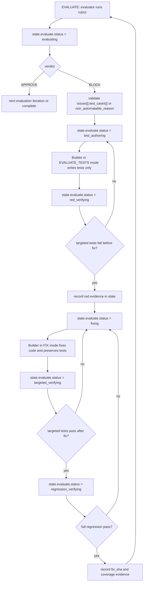

# Plan: Strict Evaluation Test Coverage Loop

## Context

The evaluation stage already has a basic loop:

`EVALUATE -> BLOCK issues -> FIX -> verify -> next EVALUATE`

The gap is that evaluation findings are not currently converted into a hard,
auditable test contract. A fix can pass generic verification without proving that
each evaluator finding has an automated regression test that failed before the
fix and passed after the fix.

The target design is the strict version:

`evaluator issue -> test_cases[] -> test authoring -> red verification -> fix -> targeted green verification -> full regression -> next evaluate`

No new top-level `HarnessState` is required. The workflow is represented through
`state.evaluate.status` sub-statuses.

---

## Issue Summary

For every CRITICAL/HIGH evaluator finding, the harness must require either:

- One or more automated `test_cases[]` that reproduce the issue, or
- A clear `non_automatable_reason` when automation is genuinely not practical.

For automated findings, the harness must independently verify:

1. The test is authored before the fix.
2. The targeted test fails before the fix.
3. The fix preserves the test and makes it pass.
4. Full regression passes before the next evaluation iteration.

---

## Root Cause

The current implementation has several trust gaps:

| Area | Current Gap |
|---|---|
| `.claude/agents/evaluator.md` | The EVALUATE signal does not require test case contracts for BLOCK issues. |
| `.claude/hooks/stop_validate_json.py` | The EVALUATE schema accepts issues without `test_cases[]` or `non_automatable_reason`. |
| `harness/evaluate.py` | `_write_evaluate_fix_md()` passes issue text to FIX, but does not enforce a test authoring/red verification stage. |
| `harness/agents.py` | `fix_evaluate_issues()` goes directly to FIX; there is no separate test-only agent step. |
| `verify_evaluate_fix()` | Verification is too coarse: it runs regression, but does not track targeted red/green evidence per evaluation issue. |

---

## Target Flow



---

## Proposed Changes

### 1. Evaluator Issue Contract

**Files**

- `.claude/agents/evaluator.md`
- `.claude/hooks/stop_validate_json.py`

**Behavior**

Every CRITICAL/HIGH BLOCK issue must include one of:

```json
{
  "test_cases": [
    {
      "id": "17.1-t1",
      "type": "unit|integration|e2e|static",
      "description": "Concrete reproduction behavior",
      "suggested_test_file": "tests/test_example.py",
      "command": ["pytest", "tests/test_example.py", "-q"],
      "pre_fix_expected": "fail",
      "pass_condition": "The targeted test passes after the bug is fixed."
    }
  ],
  "non_automatable_reason": null
}
```

or:

```json
{
  "test_cases": [],
  "non_automatable_reason": "Reason automation is not suitable for this finding."
}
```

**Condition Analysis**

- `APPROVE` with `issues: []` remains valid.
- MEDIUM/LOW issues may include test cases, but are not required to.
- CRITICAL/HIGH BLOCK issues without both `test_cases[]` and
  `non_automatable_reason` are schema-hook failures.

---

### 2. Test-Only Authoring Step

**Files**

- `.claude/agents/builder.md`
- `.claude/hooks/stop_validate_json.py`
- `.claude/hooks/stop_git_commit.py`
- `harness/agents.py`
- `harness/config.json`

**Behavior**

Add `EVALUATE_TESTS` mode. In this mode the builder:

- Reads `workspace/evaluate_fix.md`.
- Writes only automated tests for evaluator `test_cases[]`.
- Does not modify application/source/config/harness files.
- Emits:

```json
{
  "mode": "EVALUATE_TESTS",
  "phase_id": 17,
  "iteration": 1,
  "tests": [
    {
      "id": "17.1-t1",
      "issue_id": "17.1",
      "status": "authored",
      "files_changed": ["tests/test_example.py"],
      "command": ["pytest", "tests/test_example.py", "-q"]
    }
  ]
}
```

`stop_git_commit.py` must allow this mode to commit authored tests while rejecting
non-test files for this signal.

---

### 3. Red Verification Gate

**Files**

- `harness/evaluate.py`

**Behavior**

After `EVALUATE_TESTS`, harness runs the targeted test commands from:

- Authored test signal entries, and
- Evaluator `issue.test_cases[].command`.

The gate passes only when targeted commands fail before the fix. Evidence is
stored in the iteration entry:

```json
{
  "test_status": "red_verified",
  "red_verification": {
    "commands": [
      {
        "cmd": ["pytest", "tests/test_example.py", "-q"],
        "returncode": 1,
        "stdout_tail": "...",
        "stderr_tail": "..."
      }
    ]
  }
}
```

If tests do not fail, the harness records `last_test_error` and stays in the
evaluate fix loop instead of entering FIX.

---

### 4. Fix With Test Preservation

**Files**

- `.claude/agents/builder.md`
- `harness/agents.py`
- `harness/evaluate.py`

**Behavior**

FIX receives:

- `workspace/evaluate_fix.md`
- The red-verification evidence
- Instructions to preserve authored tests

The builder must not delete, skip, xfail, weaken, or change expected behavior in
the authored tests merely to make the suite pass.

FIX signal may include advisory fields:

```json
{
  "test_cases_covered": ["17.1-t1"],
  "test_files_changed": ["tests/test_example.py"]
}
```

---

### 5. Targeted Green Verification Gate

**Files**

- `harness/evaluate.py`

**Behavior**

After FIX, harness reruns the same targeted commands. The gate passes only when
all targeted tests pass. Evidence is stored as `green_verification`.

If targeted tests fail after FIX:

- Do not run full regression.
- Do not proceed to the next evaluation iteration.
- Record `last_fix_error = "targeted evaluation tests failed after fix"`.
- Keep `fix_sha` unset so resume re-enters the fix path.

---

### 6. Full Regression Verification Gate

**Files**

- `harness/evaluate.py`
- `harness/harness.py`

**Behavior**

Full regression is mandatory before the next EVALUATE iteration.

After targeted green verification, harness runs all unique verification commands
collected across phases and verification profiles, using `_select_test_cmd()` for
each phase type. Evidence is stored as:

```json
{
  "full_regression": {
    "commands": [
      {
        "cmd": ["pytest", "--ignore=harness", "--asyncio-mode=auto"],
        "returncode": 0,
        "stdout_tail": "...",
        "stderr_tail": "..."
      }
    ]
  }
}
```

If full regression fails:

- Do not set `fix_sha`.
- Do not clear `workspace/evaluate_fix.md`.
- Do not proceed to the next evaluation iteration.
- Set `state.evaluate.status = "regression_verifying"`.
- Record `last_fix_error = "full regression failed after evaluate fix"`.

This is a hard gate. Targeted tests alone are not enough.

---

## Files to Modify

| File | Change |
|---|---|
| `.claude/agents/evaluator.md` | Document required `test_cases[]` / `non_automatable_reason` for CRITICAL/HIGH BLOCK issues. |
| `.claude/agents/builder.md` | Add `EVALUATE_TESTS` mode and FIX test-preservation requirements. |
| `.claude/hooks/stop_validate_json.py` | Add `EVALUATE_TESTS` schema; extend EVALUATE/FIX schemas; enforce BLOCK issue test contracts. |
| `.claude/hooks/stop_git_commit.py` | Commit `EVALUATE_TESTS` test files only; reject non-test file paths in this mode. |
| `harness/agents.py` | Add `author_evaluate_tests()` and pass red evidence into `fix_evaluate_issues()`. |
| `harness/config.json` | Add `subprocess_timeout.EVALUATE_TESTS`. |
| `harness/evaluate.py` | Implement test-authoring, red verification, targeted green verification, and full regression gates. |
| `harness/harness.py` | Treat evaluate sub-statuses as EVALUATING for status/resume derivation. |
| `harness/tests/conftest.py` | Add test config timeout for `EVALUATE_TESTS`. |
| `harness/tests/unit/test_agents.py` | Cover prompts for test authoring, red evidence, and full regression messaging. |
| `harness/tests/unit/test_evaluate.py` | Cover strict red/green/full-regression flow and failure gates. |
| `harness/tests/unit/test_hooks.py` | Cover updated EVALUATE issue schema expectations. |

---

## Test Plan

### Unit Tests

| Test | Coverage |
|---|---|
| `test_write_evaluate_fix_md_includes_test_cases` | Confirms evaluator test cases are passed to the fix/test-authoring document. |
| `test_run_evaluate_fix_strict_flow_requires_red_green_and_full_regression` | Confirms strict flow: author tests, red fail, fix, targeted green, full regression, then `fix_sha`. |
| `test_run_evaluate_fix_full_regression_failure_blocks_next_evaluate` | Confirms full regression failure blocks progression and leaves `fix_sha` unset. |
| `test_author_evaluate_tests_prompt_is_test_only` | Confirms the test-authoring prompt is test-only and names full regression as a later harness gate. |
| `test_fix_evaluate_issues_prompt_mentions_full_regression_gate` | Confirms FIX prompt includes red evidence and full regression expectations. |
| `test_evaluate_block_signal_with_issues_passes_schema` | Confirms BLOCK issues with test cases pass schema validation. |

### Verification Commands

Focused verification:

```powershell
pytest harness/tests/unit/test_evaluate.py harness/tests/unit/test_agents.py harness/tests/unit/test_hooks.py harness/tests/unit/test_tdd_ordering.py harness/tests/unit/test_config_shape.py -q
```

Full unit regression:

```powershell
pytest harness/tests/unit -q
```

Full harness regression:

```powershell
pytest harness -q
```

The implementation should not be considered fully regressed until the full unit
or full harness command is green. Passing focused tests is not the same as full
regression.

---

## Coverage Mapping

| Requirement | Verification |
|---|---|
| CRITICAL/HIGH evaluator issues must provide test coverage or a reason | `stop_validate_json.py` schema tests |
| Test authoring must be test-only | `author_evaluate_tests()` prompt test and `stop_git_commit.py` path filter |
| Harness must verify red-before-fix | `test_run_evaluate_fix_strict_flow_requires_red_green_and_full_regression` |
| Harness must verify targeted green after FIX | `test_run_evaluate_fix_strict_flow_requires_red_green_and_full_regression` |
| Full regression must pass before next evaluation | `test_run_evaluate_fix_full_regression_failure_blocks_next_evaluate` |
| Resume/status must understand evaluate sub-statuses | `harness.py` status/resume coverage or manual status check |

---

## Risks and Mitigations

| Risk | Mitigation |
|---|---|
| Test-authoring commit leaves repository with failing tests if FIX later blocks | Store `test_status`, red evidence, and keep `fix_sha` unset so resume re-enters the evaluate fix path. |
| Evaluator proposes flaky or overly broad tests | Require deterministic commands and pass conditions in `test_cases[]`; reviewer/evaluator can flag unstable test artifacts in the next iteration. |
| Builder weakens tests during FIX | Prompt explicitly forbids weakening; future hardening can compare test diffs before/after FIX. |
| Full regression is expensive | It is intentionally a hard gate for evaluation fixes. If needed later, add affected-regression before full regression, but do not remove the full gate. |
| Non-automatable issues become escape hatches | Require `non_automatable_reason`; future review can audit repeated use. |

---

## Implementation Order

1. Extend evaluator and hook schemas.
2. Add `EVALUATE_TESTS` builder mode and hook commit support.
3. Implement `agents.author_evaluate_tests()`.
4. Update `evaluate.py` to run test authoring, red verification, fix, targeted green, and full regression.
5. Update harness status/resume derivation for evaluate sub-statuses.
6. Add focused unit tests.
7. Run focused verification.
8. Run full unit/full harness regression and resolve unrelated failures separately if present.

---

## Plan Audit

- The plan does not introduce a new top-level `HarnessState`.
- Every new evaluate sub-step is represented through `state.evaluate.status`.
- Targeted test pass is not enough; full regression is explicitly required before
  the next evaluation iteration.
- The plan distinguishes focused verification from full regression.
- Non-automatable findings are supported, but must be explicit and auditable.
- The implementation remains localized to evaluator/builder prompts, hooks,
  evaluate orchestration, agent calls, and focused tests.
