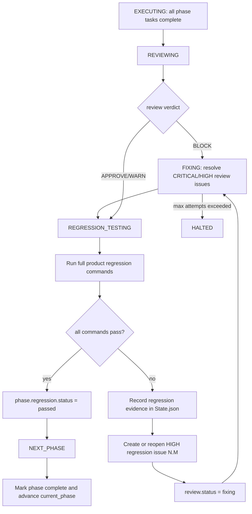

# Plan: Strict Phase Full Regression Gate

## Context

The normal phase pipeline is:

`TASK_BUILD -> EXECUTING -> REVIEWING -> FIXING -> NEXT_PHASE`

The gap is that the harness can enter `NEXT_PHASE` after task verification,
review approval, or review-fix verification without proving that the product as
a whole still passes regression tests. A phase can therefore break behavior from
an earlier phase and still advance.

The target design is the strict version:

`review/fix complete -> full product regression -> regression issue -> fix -> full product regression -> next phase`

Unlike the evaluation test coverage loop, this gate belongs to normal phase
advancement. It must run before every phase transition, not only during
`CLEANUP` or final `EVALUATING`.

---

## Issue Summary

Before entering the next phase, the harness must run full product regression
testing for the product state built so far.

If full regression passes:

- Mark `phase.regression.status = "passed"`.
- Record `passed_sha`.
- Allow `NEXT_PHASE`.

If full regression fails:

- Record failure evidence in `State.json`.
- Generate HIGH severity regression issues in the current phase.
- Reuse the existing FIX loop.
- Re-run full regression after the fix.
- Repeat until all regression commands pass or max attempts are exhausted.

Regression failures must not be treated as optional cleanup or tech debt. They
block phase advancement.

---

## Root Cause

The current implementation had several trust gaps:

| Area | Current Gap |
|---|---|
| `harness/phase_handlers.py` | `handle_next_phase()` marked the phase complete and advanced after smoke only; it did not require full regression. |
| `harness/harness.py` | The main state loop had no phase-level regression state before `NEXT_PHASE`. |
| `State.json` | There was no persistent `phase.regression` status/evidence contract for resume or debugging. |
| `harness/evaluate.py` / `harness/cleanup.py` | Full regression command collection existed only around evaluate/cleanup style checks, not as a reusable phase gate. |
| FIX prompt | Regression failures were not explicitly identified as HIGH phase blockers; the builder needed clearer instructions not to weaken tests. |
| Tests | Existing state-machine tests expected approved/fixed phases to resume straight to `NEXT_PHASE`. |

---

## Target Flow



---

## Proposed Changes

### 1. Add A Top-Level Harness State

**Files**

- `harness/harness_state.py`
- `harness/harness.py`
- `harness/phase_handlers.py`

**Behavior**

Add `HarnessState.REGRESSION_TESTING` between `FIXING` and `NEXT_PHASE`.

Transitions:

| From | Condition | To |
|---|---|---|
| `REVIEWING` | review `APPROVE` or `WARN` | `REGRESSION_TESTING` |
| `REVIEWING` | review `BLOCK` fixed by `run_fix_cycle()` | `REGRESSION_TESTING` |
| `FIXING` | fix cycle completes | `REGRESSION_TESTING` |
| `REGRESSION_TESTING` | all regression commands pass | `NEXT_PHASE` |
| `REGRESSION_TESTING` | any regression command fails | `FIXING` |
| `NEXT_PHASE` | `phase.regression.status != "passed"` | return to `REGRESSION_TESTING` |

`NEXT_PHASE` becomes an advancement-only state. It must not be responsible for
running the regression loop.

---

### 2. Persist Phase Regression State

**Files**

- `harness/state.py`
- `harness/docs/08-state-schema.md`

**Behavior**

Each phase may contain:

```json
{
  "regression": {
    "status": "pending|running|failed|passed",
    "attempts": 0,
    "commands": [["pytest"]],
    "issues": ["3.11"],
    "last_error": [],
    "last_run": {
      "commands": [
        {
          "cmd": ["pytest", "--ignore=.pytest_cache"],
          "returncode": 1,
          "stdout_tail": "...",
          "stderr_tail": "..."
        }
      ]
    },
    "last_started_at": "2026-05-18T00:00:00+00:00",
    "last_finished_at": "2026-05-18T00:00:30+00:00",
    "passed_sha": "abc123"
  }
}
```

`State.json` must make the gate resumable:

- `running`, `failed`, or missing regression after review/fix completion resumes
  to `REGRESSION_TESTING`.
- `passed` allows `NEXT_PHASE`.
- Open HIGH regression issues resume through `FIXING`.

---

### 3. Define Full Product Regression Commands

**Files**

- `harness/regression.py`
- `harness/cleanup.py`
- `harness/evaluate.py`

**Behavior**

Create shared command collection:

```python
collect_regression_commands(harness, state, through_phase_id=None)
```

Rules:

- Include product verification commands for phases up to the current phase.
- Do not include future phases.
- Use `harness.verification_profiles_for(phase_id)` when available.
- Fall back to `harness.profile_for(phase_id)`.
- Use `_select_test_cmd(profile, phase_type)` so integration/e2e phases use
  `integration_test_cmd`.
- De-duplicate commands by exact command tuple.

This full regression is product regression, not harness self-test. For example:

- `pytest` or profile-specific product tests count.
- `npm run test:e2e` can count when configured for e2e.
- `pytest harness/tests/...` is not the product regression gate unless a profile
  explicitly defines it as product verification.

This also addresses the earlier confusion: a narrow result such as `237 passed`
from selected harness tests is not full product regression.

---

### 4. Convert Regression Failures Into Current-Phase Issues

**Files**

- `harness/regression.py`
- `harness/fix.py` through existing FIX loop behavior
- `.claude/hooks/stop_validate_json.py` remains unchanged

**Behavior**

Regression issues reuse the current phase's normal issue ID space.

Example:

- Review found issues `5.1` through `5.10`.
- Full regression then fails.
- First regression issue becomes `5.11`.
- Next distinct regression failure becomes `5.12`.

This avoids changing the existing FIX schema, which already expects:

```text
^\d+\.\d+$
```

Regression issue shape:

```json
{
  "id": "5.11",
  "severity": "HIGH",
  "dimension": "Regression",
  "file": "FULL_REGRESSION",
  "title": "Full regression failed before phase advancement",
  "status": "open",
  "attempts": 0,
  "files_changed": [],
  "fixed_sha": null,
  "last_error": [
    "full regression command failed: pytest --ignore=.pytest_cache (returncode=1)"
  ],
  "source": "regression",
  "regression_key": "dedupe-hash",
  "regression_evidence": {
    "cmd": ["pytest", "--ignore=.pytest_cache"],
    "returncode": 1,
    "stdout_tail": "...",
    "stderr_tail": "..."
  }
}
```

Condition analysis:

- `severity` must be `HIGH` so the existing fix cycle treats it as blocking.
- The next ID must be based on the highest current phase issue sequence, not on
  the original review issue count.
- Repeated failure of the same command/output signature should reopen the same
  regression issue instead of creating duplicates.
- Distinct regression failures may create new issue IDs.

---

### 5. Feed Regression Issues To The Existing FIX Loop

**Files**

- `harness/phase_handlers.py`
- `harness/regression.py`
- `harness/agents.py`
- `.claude/agents/builder.md`

**Behavior**

When regression fails:

1. Write or update `phase.review.issues[]`.
2. Set `phase.review.status = "fixing"`.
3. Append issue blocks to `workspace/review_report.md`.
4. Return `HarnessState.FIXING`.

The existing `run_fix_cycle()` can then handle regression issues because they
are normal HIGH issues with normal `N.M` IDs.

Builder instructions must say:

- Treat `Dimension: Regression` as a HIGH phase advancement blocker.
- Fix product behavior or legitimate test integration problems.
- Do not delete, skip, xfail, or weaken regression tests merely to pass.

---

### 6. Resume And Status Reporting

**Files**

- `harness/harness.py`

**Behavior**

`_derive_state()` must route:

| State.json condition | Resume state |
|---|---|
| `review.status in ("complete", "fixed")` and `regression.status != "passed"` | `REGRESSION_TESTING` |
| `review.status = "fixing"` | `FIXING` |
| `regression.status = "passed"` and review complete/fixed | `NEXT_PHASE` |

Status summaries should expose:

- `regression_status`
- `regression_attempts`
- current error from `phase.regression.last_error` when regression failed

This matters for monitoring: a stopped harness should be able to report that it
was blocked in regression rather than vaguely in review/fix.

---

## Files To Modify

| File | Planned Change |
|---|---|
| `.claude/agents/builder.md` | Add FIX-mode instruction for regression blockers and preserving regression tests. |
| `.gitignore` | Ignore `.tmp/` used for local pytest temp dirs on Windows. |
| `harness/agents.py` | Add regression-specific FIX prompt text. |
| `harness/cleanup.py` | Reuse shared regression command collection. |
| `harness/evaluate.py` | Reuse shared regression command collection for evaluate full regression. |
| `harness/harness_state.py` | Add `REGRESSION_TESTING`. |
| `harness/harness.py` | Add main-loop dispatch, resume derivation, status summary, current-error handling. |
| `harness/phase_handlers.py` | Route review/fix success to regression; add regression handler; guard `NEXT_PHASE`. |
| `harness/regression.py` | New module for command collection, command execution, evidence recording, issue creation/reopen, review report update. |
| `harness/state.py` | Allow `phase.regression` updates through state helpers. |
| `harness/docs/08-state-schema.md` | Document `phase.regression` and regression issue contract. |
| `harness/tests/unit/test_regression.py` | Unit tests for command collection and regression issue handling. |
| `harness/tests/unit/test_phase_handlers.py` | Update expected transitions and add regression handler tests. |
| `harness/tests/unit/test_harness.py` | Resume/status tests for regression gate. |
| `harness/tests/unit/test_verify.py` | Align stale pytest command expectation with current `verify.py` behavior: no `--basetemp`. |
| `harness/tests/integration/test_resume.py` | Integration resume tests for `REGRESSION_TESTING` and passed gate. |
| `harness/tests/integration/test_state_machine.py` | Update review approval flow to enter regression gate. |

---

## Tests

### New Unit Tests

| Test | Purpose |
|---|---|
| `test_collect_regression_commands_deduplicates_and_stops_at_current_phase` | Ensures command collection is unique and excludes future phases. |
| `test_run_phase_regression_gate_pass_marks_status_passed` | Passing commands mark regression passed and record SHA. |
| `test_run_phase_regression_gate_fail_creates_high_issue_with_next_phase_id` | Failed regression creates `N.(max+1)` HIGH issue. |
| `test_run_phase_regression_gate_reopens_existing_regression_issue` | Repeated failure reopens the existing regression issue and increments attempts. |
| `test_handle_regression_testing_pass_returns_next_phase` | Regression handler advances only after pass. |
| `test_handle_regression_testing_fail_returns_fixing` | Regression handler routes failures to FIX. |
| `test_resume_approved_phase_without_regression_enters_regression_testing` | Resume cannot skip full regression after review approval. |

### Updated Tests

| Test Area | Update |
|---|---|
| `test_phase_handlers.py` | Review/fix success now expects `REGRESSION_TESTING`, not `NEXT_PHASE`. |
| `test_harness.py` | Existing `NEXT_PHASE` resume tests now require `phase.regression.status="passed"`. |
| `test_resume.py` | Approved phase without passed regression resumes to regression gate. |
| `test_state_machine.py` | Review approval flow enters regression. |
| `test_verify.py` | Expected pytest command no longer includes `--basetemp`, matching current `verify.py`. |

---

## Coverage Mapping

| Behavior | Test / Verification |
|---|---|
| New state exists and is dispatchable | `test_handle_regression_testing_pass_returns_next_phase`, main-loop coverage in `test_harness.py` |
| Review approval cannot skip regression | `test_handle_reviewing_returns_regression_testing`, integration state-machine update |
| Review fix cannot skip regression | `test_handle_fixing_returns_regression_testing` |
| Direct `NEXT_PHASE` is guarded | Existing `handle_next_phase` tests require `regression.status="passed"` |
| Full regression command collection is shared and de-duplicated | `test_collect_regression_commands_deduplicates_and_stops_at_current_phase` |
| Regression pass records status/SHA | `test_run_phase_regression_gate_pass_marks_status_passed` |
| Regression failure creates HIGH issue with valid ID | `test_run_phase_regression_gate_fail_creates_high_issue_with_next_phase_id` |
| Repeated regression failure does not spam duplicate issues | `test_run_phase_regression_gate_reopens_existing_regression_issue` |
| Resume returns to regression when gate is not passed | `test_resume_approved_phase_without_regression_enters_regression_testing` |
| Broader unchanged harness behavior remains stable | `pytest harness/tests/unit -q`, `pytest harness/tests/integration -q` |

---

## Regression Checks

These checks must remain green:

```powershell
pytest harness/tests/unit/test_regression.py harness/tests/unit/test_phase_handlers.py harness/tests/unit/test_harness.py -q
pytest harness/tests/unit -q
pytest harness/tests/integration -q
```

On Windows, if the default user temp directory is locked or inaccessible, run:

```powershell
New-Item -ItemType Directory -Force -Path .tmp\pytest | Out-Null
$env:TMP=(Resolve-Path .tmp\pytest)
$env:TEMP=$env:TMP
pytest harness/tests/unit -q
pytest harness/tests/integration -q
```

---

## Verification Criteria

Implementation is complete only when:

1. `REGRESSION_TESTING` appears in the state machine.
2. Review/fix success no longer advances directly to `NEXT_PHASE`.
3. `NEXT_PHASE` refuses to advance unless `phase.regression.status == "passed"`.
4. A failed regression command writes evidence into `phase.regression.last_run`.
5. A failed regression command creates or reopens a HIGH issue in
   `phase.review.issues[]`.
6. Regression issue IDs remain valid `N.M` IDs.
7. Regression issues are visible to FIX through `workspace/review_report.md`.
8. FIX prompt tells builder not to delete/skip/weaken regression coverage.
9. Full unit regression passes.
10. Integration resume/state-machine tests pass.

---

## Implementation Order

1. Add `REGRESSION_TESTING` enum value.
2. Add `harness/regression.py` with command collection, command execution,
   evidence recording, and issue creation.
3. Reuse `collect_regression_commands()` from cleanup and evaluate.
4. Route `handle_reviewing()` and `handle_fixing()` to `REGRESSION_TESTING`.
5. Add `handle_regression_testing()`.
6. Guard `handle_next_phase()` so it requires `phase.regression.status="passed"`.
7. Update `_derive_state()` and status summary in `harness.py`.
8. Update builder/FIX prompt instructions.
9. Document `phase.regression` in state schema.
10. Add unit tests and update state-machine/resume expectations.
11. Run targeted tests.
12. Run full unit and integration regression.

---

## Risks And Mitigations

| Risk | Mitigation |
|---|---|
| Full regression is slow | De-duplicate commands and run only phases up to the current phase. Future phases are excluded. |
| Regression commands are flaky | Store command, return code, and output tails so failures can be diagnosed; do not silently advance. |
| External dependencies fail | Treat command evidence distinctly from review/fix agent failures; if a command is environment-dependent, the failure is visible in State.json. |
| FIX agent weakens tests to pass | Prompt explicitly forbids deleting, skipping, xfail-ing, or weakening regression tests. |
| Regression issue IDs conflict with FIX schema | Use the current phase's normal `N.M` issue numbering rather than custom IDs such as `N.regression.1`. |
| Duplicate regression failures spam issues | Use `regression_key` based on command and output tails to reopen the existing issue. |
| Resume skips the gate | `_derive_state()` maps complete/fixed review plus non-passed regression to `REGRESSION_TESTING`. |
| Cleanup/evaluate command collection diverges | Share the command collection helper from `harness/regression.py`. |

---

## Final Plan Audit

- The root cause maps directly to the missing phase advancement gate.
- The solution is state-machine explicit and resumable.
- The issue ID strategy keeps the existing FIX schema unchanged.
- Every regression failure has State.json evidence and a HIGH issue.
- Existing FIX behavior is reused instead of inventing a second fix path.
- Tests cover pass, fail, resume, duplicate failure, and transition behavior.
- Full unit and integration regression are required as verification.
